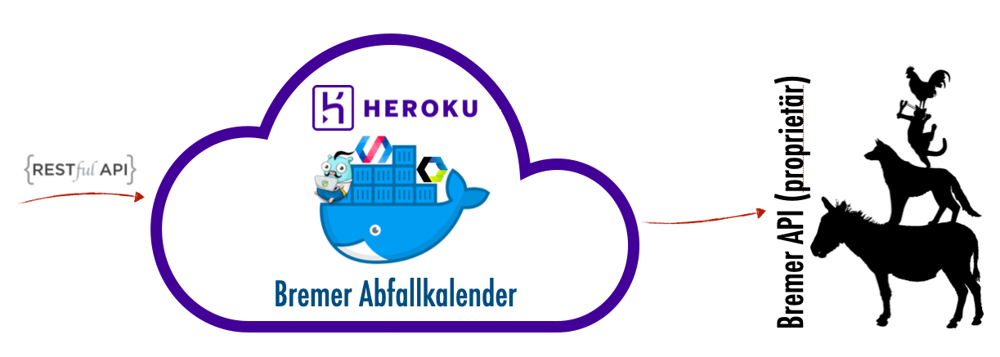

# Bremer Abfallkalender API

[](https://github.com/digitalesbremen/abfallkalender_api/actions/workflows/docker-build-and-push.yml)
[](https://opensource.org/licenses/Apache-2.0)

This project is still alpha an in development. 



```shell
# Login to heroku
$ heroku container:login

# Create app (if not existing)
$ heroku create bremer-abfallkalender-api

# Push docker container to heroku registry
$ heroku container:push web --app bremer-abfallkalender-api

# Release app
$ heroku container:release web

# Open app
$ heroku open --app bremer-abfallkalender-api

# Logs
$ heroku logs -n 200 --app bremer-abfallkalender-api
$ heroku logs --tail --app bremer-abfallkalender-api
```